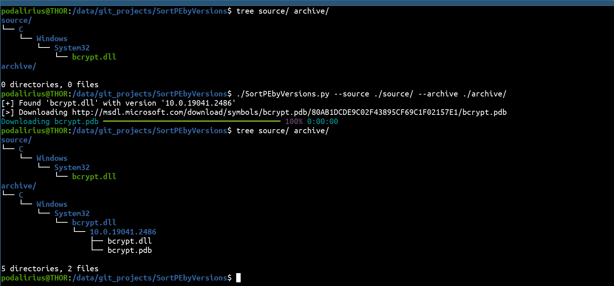

<p align="center">
    A Python script to sort Portable Executable (PE) files by their version and download debug symbols if existing.
    <br>
    
    <a href="https://twitter.com/intent/follow?screen_name=podalirius_" title="Follow"></a>
    <a href="https://www.youtube.com/c/Podalirius_?sub_confirmation=1" title="Subscribe"></a>
    <br>
</p>

## Features

 - [x] Automatically download PDB symbols from `msdl.microsoft.com` if applicable.
 - [x] Process a batch of Portable Executable (PE) files from a source folder (option `--source`).

## Usage

```
$ ./SortPEbyVersions.py -h
usage: SortPEbyVersions.py [-h] -s SOURCE_DIR -a ARCHIVE_DIR [-v]

Sort Portable Executable (PE) files by their version and download debug symbols if existing.

options:
  -h, --help            show this help message and exit
  -s SOURCE_DIR, --source-dir SOURCE_DIR
                        Source directory where to get PE files.
  -a ARCHIVE_DIR, --archive-dir ARCHIVE_DIR
                        Archive directory where to store PE files by versions.
  -v, --verbose         Verbose mode. (default: False)
```

## Example



## Contributing

Pull requests are welcome. Feel free to open an issue if you want to add other features.
